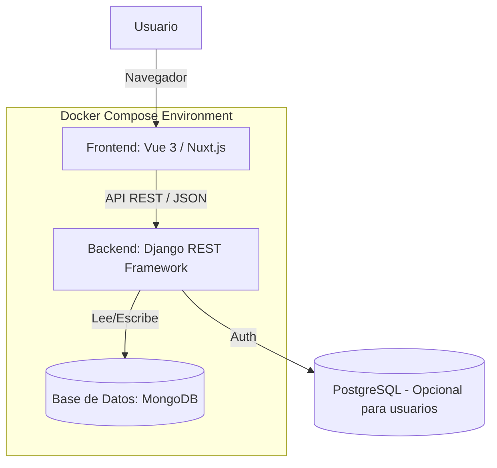

# Plan Maestro: Proyecto Fullstack "Ingeniería 360"

Este es un plan de acción para dominar el stack: **Vue.js + Django + MongoDB + Docker**.
Para justificar esta complejidad, no haremos una simple calculadora. Haremos una **Plataforma SaaS de Gestión de Activos y Herramientas Técnicas**.

---

## 1. El Concepto: "Ingeniería 360"
Una aplicación para empresas de ingeniería que permite:
1.  **Gestión de Inventario Dinámico:** Guardar equipos (sensores, motores, PLCs) donde cada uno tiene características técnicas únicas (perfecto para MongoDB).
2.  **Caja de Herramientas:** Calculadoras técnicas (Ley de Ohm, Conversión 4-20mA) que guardan el historial de cálculos por usuario.
3.  **Reportes PDF:** Generar hojas de datos de los equipos (Django es excelente para esto).

## 2. La Arquitectura (El Stack)

### ¿Por qué estas tecnologías?
*   **Frontend (Vue.js / Nuxt.js):** Vue es más "amable" que React y separa claramente HTML, JS y CSS. Nuxt.js es su "metaframework" (como Next.js) que te da estructura profesional.
*   **Backend (Django):** Es un "framework con baterías incluidas". Trae panel de administración, autenticación y seguridad listos.
*   **Base de Datos (MongoDB):**
    *   *Caso de uso real:* Un "Motor" tiene `HP` y `RPM`. Un "Sensor" tiene `Rango` y `Voltaje`. En SQL (tablas) esto es difícil de modelar. En MongoDB (documentos), puedes guardar lo que quieras en cada objeto. ¡Ideal para este proyecto!
*   **Docker:** Empaquetará tu Django, tu Mongo y tu Vue en "cajitas" para que corran igual en tu PC y en el servidor.

---

## 3. Hoja de Ruta (Roadmap)

### Fase 1: El Backend (Django + MongoDB)
**Objetivo:** Crear la API que maneje los datos.
1.  Instalar **Python** y **Django**.
2.  Instalar **Djongo** (conector para usar Mongo con Django) o **MongoEngine**.
3.  Crear modelos: `Usuario`, `Equipo`, `CalculoHistorial`.
4.  Crear endpoints (URLs) para que el frontend pida datos:
    *   `GET /api/equipos/`
    *   `POST /api/calcular-ohm/`

### Fase 2: El Frontend (Vue.js + Nuxt)
**Objetivo:** La interfaz visual.
1.  Iniciar proyecto con **Nuxt.js** (`npx nuxi init`).
2.  Crear componentes: `CalculadoraOhm.vue`, `ListaEquipos.vue`.
3.  Conectar con Django usando `fetch` o `axios`.
4.  Implementar gráficos (Chart.js) para mostrar estadísticas de los equipos.

### Fase 3: Dockerización (El Despliegue Profesional)
**Objetivo:** Que todo corra con un solo comando.
1.  Crear un `Dockerfile` para Django (instalar python, dependencias).
2.  Crear un `Dockerfile` para Nuxt (instalar node, build).
3.  Crear un `docker-compose.yml` que diga:
    *   "Levanta Mongo".
    *   "Levanta Django y conéctalo a Mongo".
    *   "Levanta Nuxt y conéctalo a Django".

---

## 4. ¿Por qué este proyecto es "Superior"?
Este proyecto cubre huecos que una simple "To-Do List" no cubre:
1.  **Modelado de Datos Complejo:** Aprendes cuándo usar NoSQL (Mongo) vs SQL.
2.  **Arquitectura Desacoplada:** Frontend y Backend están separados (se hablan por API). Así trabajan las grandes empresas.
3.  **DevOps:** Al usar Docker, estás practicando cómo se despliega software real en la nube (AWS, Azure, DigitalOcean).

## 5. Siguientes Pasos
Si aceptas la misión, tu primer paso no es programar, es **instalar las herramientas**:
*   [ ] Instalar Python & Node.js
*   [ ] Instalar Docker Desktop
*   [ ] Instalar MongoDB Compass (para ver la base de datos visualmente)

¿Te animas a empezar esta nueva aventura? 🛠️🚀
